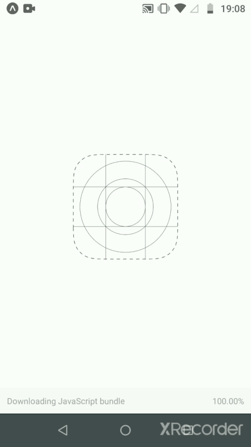

# Next-Level-Week

Projeto construido durante a Next Level Week (evento da Rocketseat) com foco na stack NodeJs, ReactJs e React Navtive. O projeto desenvolvido consistiu em um site para cadastrar pontos de coleta e um aplicativo para procurar pontos de coleta (e uma API para guardar as informações e comunicar entre a parte web e a parte mobile). Para as partes extras que produzi do projeto (pesquisa de pontos na web e vizualização dos detalhes de cada ponto) fiz apenas com o que lembrava dos designs, tendo em vista que o link não foi mais exposto ao fim do evento.

## Tecnologias

Neste evento o foco foi em partes funcionais da aplicação, em como organizar os componentes e passar as informações pelas telas, deixando de lado a parte de CSS. Além disso,foi utilizado TypeScript em todas as partes do projeto.

### NodeJs

Node foi utilizado para construir o back end da aplicação, com express e knex. Deste evento os dois ensinamentos mais diferenciados foram transactions (ligar atividades do banco de dados para que só sejam criadas se todas procederem corretamente), e o upload de arquivos com o pacote multer.

### ReactJs

React foi utilizado para construir o front end da aplicação. Neste evento a página construída no front end foi realmente grande comparado com os outros projetos gratuitos oferecidos pela Rocketseat. Vários conceitos foram apresentados e exaustivamente aplicados, como a forma de utilizar os estados e os useEffect. Além disso uma estrutura mais robusta que nos permite observar a forma de escrever componentes html utilizando de sua semântica, e integrando os mesmos com APIs externas, como API de mapas e as do IBGE.

### React Native

React Native foi utilizado para fazer a parte mobile da aplicação, utilizando o expo e seu pacote de mapas. Nesta parte os principais aprendizados foram no uso dos pacotes do expo, que facilitam o desenvolvimento das aplicações.

## Como utilizar

- Clonar o repositório
- Entrar na pasta "server" e rodar o seguinte comando

```bash
npm install && npm run dev
```

#### Versão Web

- Entrar na pasta "web" e rodar o seguinte comando

```bash
npm install && npm start
```

#### Versão Mobile (requer Expo)

- Entrar na pasta "mobile" e rodar o seguinte comando

```bash
npm install && expo start
```

## Versão final

#### Demonstração da versão web


#### Demonstração da versão mobile


